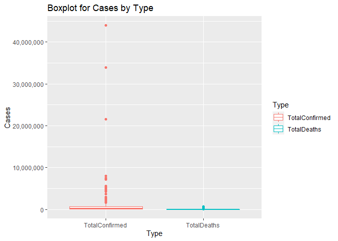

README
================
Victoria Seng
9/21/2021

-   [Required Packages (will update if additional are
    needed)](#required-packages-will-update-if-additional-are-needed)
-   [Functions](#functions)
    -   [`getSummaryGlobal()`](#getsummaryglobal)
    -   [`getSummaryCountries()`](#getsummarycountries)
    -   [`getCountries()`](#getcountries)
    -   [`returnSlug()`](#returnslug)
    -   [`handleTZ()`](#handletz)
    -   [`handleDT()`](#handledt)
    -   [`getDayOneLive()`](#getdayonelive)
    -   [`getCountryLive()`](#getcountrylive)
    -   [`getLiveCS()`](#getlivecs)
    -   [`getLiveCAS()`](#getlivecas)
-   [Exploratory Data Analysis (EDA)](#exploratory-data-analysis-eda)
-   [Wrap Up](#wrap-up)

# Required Packages (will update if additional are needed)

-   `tidyverse`
-   `httr`
-   `jsonlite`
-   `stringr`
-   `lubridate`
-   `matrixStats`

# Functions

-   `getSummaryGlobal()`
-   `getSummaryCountries()`
-   `getCountries()`
-   `returnSlug()`
-   `handleTZ()`
-   `handleDT()`
-   `getDayOneLive()`
-   `getByCountryLive()`
-   `getLiveCS()`
-   `getLiveCAS()`

## `getSummaryGlobal()`

Grabs the daily summary, which shows total and new cases by case type

``` r
getSummaryGlobal <- function(){
  resp <- GET("https://api.covid19api.com/summary")
  content <- fromJSON(rawToChar(resp$content))
  summary <- as_tibble(content$Global)
  return(summary)
}
```

## `getSummaryCountries()`

Grabs the daily summary by country and case type

``` r
getSummaryCountries <- function(){
  resp <- GET("https://api.covid19api.com/summary")
  content <- fromJSON(rawToChar(resp$content))
  summary <- as_tibble(content$Countries)
  return(summary)
}
```

## `getCountries()`

Grabs all country names, slugs, and abbreviations. It is used inside all
other functions where the user inputs `country` as an argument.

``` r
getCountries <- function(){
  resp <- GET("https://api.covid19api.com/countries")
  countries <- as_tibble(fromJSON(rawToChar(resp$content)))
  return(countries)
}
```

## `returnSlug()`

Takes a quoted string and returns the country slug (if available) as a
character string. Argument can be the name of the country, the slug, or
the ISO2 abbreviation. Throws a specific error if no match is found.

``` r
returnSlug <- function(cntry){
  countries <- getCountries() ## grab all the countries as a tibble
  
  slug <- countries %>%
    filter(
        case_when(
          cntry %in% Country ~ cntry == Country,
          cntry %in% ISO2    ~ cntry == ISO2,
          cntry %in% Slug    ~ cntry == Slug
      ) ## figure out which column the argument is referencing, then filter to the correct row 
    ) %>% 
      select(Slug) ## grab the slug
  
  if(nrow(slug) == 0) stop(
    paste0(
      cntry, " is not a country name, slug, or ISO2 value supported by the api"
    ) ## if there is no match, the resulting tibble will have 0 rows. Throw an error if this happens
  )
  
  return(unname(unlist(slug))) ## turn the slug into a character string and return it
}
```

## `handleTZ()`

This function takes a character string and tries to find a match in
`OlsonNames()`. If an exact match cannot be found, a partial match is
searched for. If one is found, it is used, but a warning is thrown. If
that cannot be found, the function returns a TZ of “UTC” and throws a
warning.

``` r
handleTZ <- function(z = "UTC"){
  #handle the time zone
  olson <- OlsonNames()
  zone <- if(z %in% olson) {z} else {NULL} # if the zone is an exact match, use it
  
  found <- if(is_null(zone)) {
    unlist(
      lapply(
        olson, function(x){
          if(grepl(z, x)) {x} else {NULL}
        }
      )
    )
  } # if not, search for a matching string within olson.
  
  if(is_null(zone) & (length(found) > 1 | is_null(found))) {
    zone <- "UTC"
    warning(
      paste0(z, " is not a recognized time zone. Defaulting to UTC.")
    ) # If no match or too many matches are found, just use UTC. But warn the user.
  } else if(is_null(zone) & length(found) == 1) {
    zone <- found
    warning(
      paste0(z, " is not a recognized time zone. Using closest match, ", found, ".")
    ) # if a single match is found, use it. But warn the user.
  }
  return(zone)
}
```

## `handleDT()`

this takes a date string and gives it back in the correct format

``` r
handleDT <- function(date, z){
  zone <- if(!is_null(z)){handleTZ(z)} else {"UTC"} # handle the time zone
  dt <- str_replace_all(date, "/", "-") #preliminary data cleaning
  
  cleanDT <- if(
    str_detect(
      dt, "^[:digit:]{4}-[:digit:]{2}-[:digit:]{2}([:space:]|T)[:digit:]{2}:[:digit:]{2}:[:digit:]{2}"
    )
  ) {ymd_hms(dt, tz = zone)} else if(
    str_detect(
      dt, "^[:digit:]{4}-[:digit:]{2}-[:digit:]{2}([:space:]|T)[:digit:]{2}:[:digit:]{2}"
    )
  ) {ymd_hm(dt, tz = zone)} else if(
    str_detect(
      dt, "^[:digit:]{4}-[:digit:]{2}-[:digit:]{2}([:space:]|T)[:digit:]{2}"
    )
  ) {ymd_h(dt, tz = zone)} else if(
    str_detect(
      dt, "^[:digit:]{4}-[:digit:]{2}-[:digit:]{2}"
    )
  ) {ymd(dt, tz = zone)} else {stop(paste0("Could not parse ", date, " into a datetime object."))}
  
  cleanUTC <- toString(if(zone != "UTC") {with_tz(cleanDT, "UTC")} else {cleanDT}) # translate to UTC if needed
  dtStr <- paste0(substr(cleanUTC,1,10),"T", substr(cleanUTC,12,19),"Z")
  return(dtStr)
}
```

## `getDayOneLive()`

This endpoint returns all cases of the specified case type for the
specified country from its first recorded case to present (updated every
10 minutes.)

Its arguments are `country` and `caseType`.

``` r
getDayOneLive <- function(country, caseType){
  resp <- GET(
    paste0(
      "https://api.covid19api.com/dayone/country/",returnSlug(country),"/status/",caseType,"/live"
    )
  )
  df <- as_tibble(fromJSON(rawToChar(resp$content)))
  return(df)
}
```

## `getCountryLive()`

Takes a country, from datetime string, and optionally a to and time zone
string and returns cases by date

``` r
getCountryLive <- function(country, from, to = NULL, z = NULL){
  params <- paste0(
    returnSlug(country),"/status/confirmed/live?from=",handleDT(from, z)
  )
  if(!is_null(to)){params <- paste0(params, "&to=", handleDT(to, z))}
  
  resp <- GET(
    paste0(
      "https://api.covid19api.com/country/", params
    )
  )
  df <- as_tibble(fromJSON(rawToChar(resp$content)))
  return(df)
}
```

## `getLiveCS()`

takes country, case type and returns cases by date

``` r
getLiveCS <- function(country, caseType){
  params <- paste0(
    returnSlug(country),"/status/",caseType)
  
  resp <- GET(
    paste0(
      "https://api.covid19api.com/country/", params
    )
  )
  df <- as_tibble(fromJSON(rawToChar(resp$content)))
  return(df)
}
```

## `getLiveCAS()`

takes country name and returns live cases for all casetypes by date

``` r
getLiveCAS <- function(country){
  params <- paste0(
    returnSlug(country))
  
  resp <- GET(
    paste0(
      "https://api.covid19api.com/live/country/", params
    )
  )
  df <- as_tibble(fromJSON(rawToChar(resp$content)))
  return(df)
}
```

# Exploratory Data Analysis (EDA)

First, we’ll pull the summary stats by country and look at total
confirmed cases vs total deaths as a scatter plot. Here, we see what
we’d expect, that more cases usually means more deaths. There are three
particularly large country datapoints here, and we can assume that these
are larger population countries.

``` r
summary <- getSummaryCountries()

df <- ggplot(data = summary) 

df + geom_point(aes(x = TotalConfirmed, y = TotalDeaths)) +
  labs(title = "Total Confirmed Cases v Total Deaths for Each Country", x = "Confirmed", y = "Deaths") +
    theme(axis.text.x = element_text(angle = 270)) +
      scale_x_continuous(labels = scales::comma) +
        scale_y_continuous(labels = scales::comma)
```

<!-- -->

I’d like to look at a contingency table of confirmed versus deaths for
these countries. To do this, I’m dividing the case numbers into buckets.
The biggest The largest group of countries in the contingency table have
between 100K and 1M cases, but fewer than 10K deaths.

``` r
factorLvls <- c("0-1,000", "1,000-9,999", "10,000-99,999", "100,000-999,999", "1,000,000-9,999,999", "Over 10,000,000")
bracketNums <- c(1000, 10000, 100000, 1000000, 10000000)

ccWithBrackets <- summary %>%
  select(CountryCode, TotalConfirmed, TotalDeaths) %>%
    mutate(confirmed = if_else(
      TotalConfirmed < bracketNums[1], factorLvls[1], if_else(
        TotalConfirmed < bracketNums[2], factorLvls[2], if_else(
          TotalConfirmed < bracketNums[3], factorLvls[3], if_else(
            TotalConfirmed < bracketNums[4], factorLvls[4], if_else(
              TotalConfirmed < bracketNums[5], factorLvls[5], factorLvls[6]
            )
          )
        )
      )
    ), deaths = if_else(
      TotalDeaths < bracketNums[1], factorLvls[1], if_else(
        TotalDeaths < bracketNums[2], factorLvls[2], if_else(
          TotalDeaths < bracketNums[3], factorLvls[3], if_else(
            TotalDeaths < bracketNums[4], factorLvls[4], if_else(
              TotalDeaths < bracketNums[5], factorLvls[5], factorLvls[6]
            )
          )
        )
      )
    )
  )  

table(ccWithBrackets$confirmed, ccWithBrackets$deaths)
```

    ##                      
    ##                       0-1,000 1,000-9,999 10,000-99,999 100,000-999,999
    ##   0-1,000                   8           0             0               0
    ##   1,000-9,999              21           1             0               0
    ##   1,000,000-9,999,999       0           1            21              10
    ##   10,000-99,999            38          12             0               0
    ##   100,000-999,999           4          53            20               0
    ##   Over 10,000,000           0           0             0               3

Moving away from the uneven buckets above, we’ll view the buckets of
confirmed cases as a histogram. The three largest values have been
removed. The largest buckets have fewer cases. I think that is likely
because a lot of countries in this data set are small. It’d be more
useful to have access to population so we could calculate cases per x
people.

``` r
rows <- nrow(ccWithBrackets)

df <- ggplot(data = ccWithBrackets %>% slice_min(TotalConfirmed, n = (rows-3)))

df + geom_histogram(aes(x = TotalConfirmed), bins = 20) +
  theme(axis.text.x = element_text(angle = 270)) +
    scale_x_continuous(labels = scales::comma) +
      labs(title = "Histogram of Confirmed Cases by COuntry", x = "Case Buckets")
```

<!-- -->

Pivoting the data to be a bit easier to work with. Now let’s look at the
summary stats for confirmed and deaths for all countries. Its difficult
to see much here because of the outliers. Rather than delete them, I’d
rather have access to population, as mentioned above, to get a more
useful stat than raw case numbers.

``` r
summPivot <- summary %>%
  pivot_longer(cols = starts_with("Total"), names_to = "Type", values_to = "Cases", values_drop_na = TRUE) %>%
    select(CountryCode, Type, Cases) %>%
      filter(Type %in% c("TotalConfirmed", "TotalDeaths"))

ggplot(summPivot, aes(Type, Cases)) +
  geom_boxplot() +
    scale_y_continuous(labels = scales::comma) +
      labs(title = "Boxplot for Cases by Type")
```

<!-- -->

This is just a little something to tell us who those top 3 countries
are. The US is one of them. Let’s take this opportunity to go more
local.

``` r
top3 <- ccWithBrackets %>%
  select(CountryCode, TotalConfirmed) %>%
    slice_max(TotalConfirmed , n = 3)

top3
```

    ## # A tibble: 3 x 2
    ##   CountryCode TotalConfirmed
    ##   <chr>                <int>
    ## 1 US                43852255
    ## 2 IN                33853048
    ## 3 BR                21478546

This very crowded bar chart shows cases versus deaths for the top 3.

``` r
ggplot(summPivot %>% filter(CountryCode %in% c("US", "IN", "BR")), aes(CountryCode)) +
  geom_bar(aes(y = Cases, fill = Type), stat = "identity", position = "dodge") +
      labs(title = "Cases by Type for 3 Largest Case Counts", x = "Country", fill = "") +
        theme(axis.text.x = element_text(angle = 90)) +
          scale_y_continuous(labels = scales::comma) +
            scale_fill_brewer(palette = "Set2")
```

<!-- --> Here, we have North Carolina
overall and by country with summary statistics. For counties, we have a
contingency table to show whether a county’s mean cases are over or
under the state level. Over half are under. We can assume that a few
counties are inflating the overall mean.

``` r
nc <- unlist(getCountryLive("united-states", "2021-09-24T00:00:00", to = "2021-09-30T00:00:00", z = "UTC") %>%
  filter(Province == "North Carolina") %>%
    group_by(Province) %>%
      summarize(min = min(Cases), mean = mean(Cases), median = median(Cases), IQR = IQR(Cases), max = max(Cases))
)

nc
```

    ##           Province                min               mean             median                IQR                max 
    ##   "North Carolina"                "0" "13529.2759103641"           "7096.5"         "11684.25"           "150490"

``` r
ncCounties <- getCountryLive("united-states", "2021-09-24T00:00:00", to = "2021-09-30T00:00:00", z = "UTC") %>%
  filter(Province == "North Carolina") %>%
    group_by(Province, City) %>%
      summarize(min = min(Cases), mean = mean(Cases), median = median(Cases), IQR = IQR(Cases), max = max(Cases)) %>%
        mutate(bucket = if_else(mean <= as.numeric(nc["mean"]), "under", "over")) 

table(ncCounties$bucket)
```

    ## 
    ##  over under 
    ##    29    73

Here, we do the same thing for Virginia and concatenate the states so we
can compare them.

``` r
vaCounties <- getCountryLive("united-states", "2021-09-24T00:00:00", to = "2021-09-30T00:00:00", z = "UTC") %>%
  filter(Province == "Virginia") %>%
    group_by(Province, City) %>%
      summarize(min = min(Cases), mean = mean(Cases), median = median(Cases), IQR = IQR(Cases), max = max(Cases))

bothStates <- rbind(ncCounties, vaCounties)
```

This box plot shows that on average, North Carolina has confirmed more
cases than Virginia.

``` r
ggplot(bothStates, aes(Province, mean)) +
  geom_boxplot() +
    scale_y_continuous(labels = scales::comma) +
      labs(title = "NC vs VA: Boxplot for Mean Confirmed Cases by County 9/24-9/30")
```

<!-- -->

# Wrap Up

In summary, I wrote functions to 6 endpoints of the covid19 api and
demonstrated connecting and summarizing data from a couple of endpoints.
We learned that population data would help this data set a lot.
